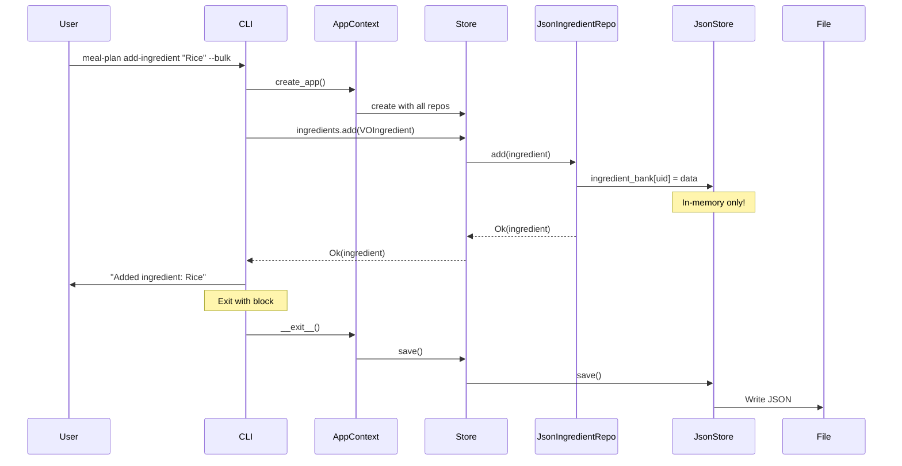
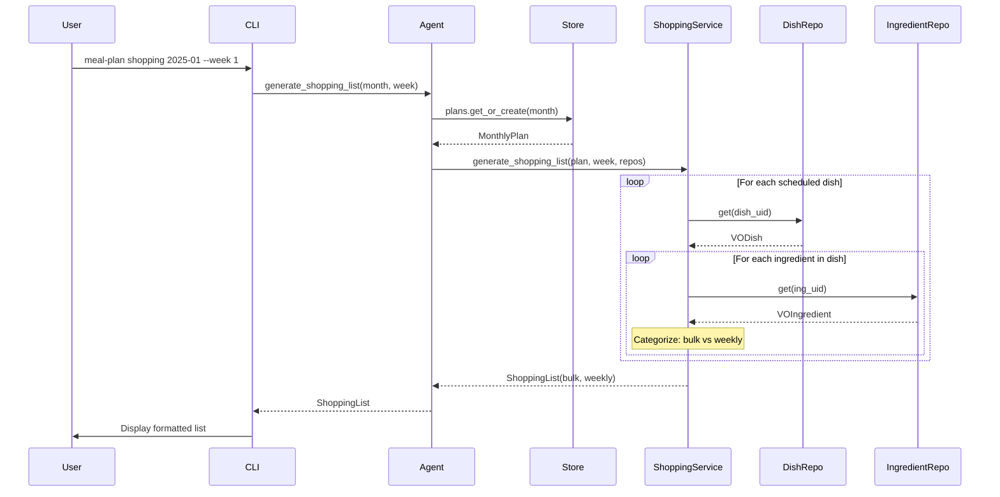
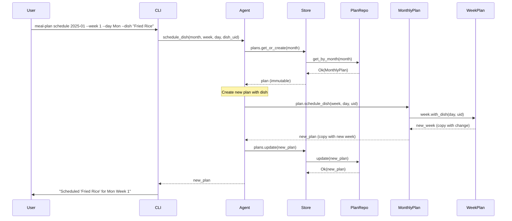
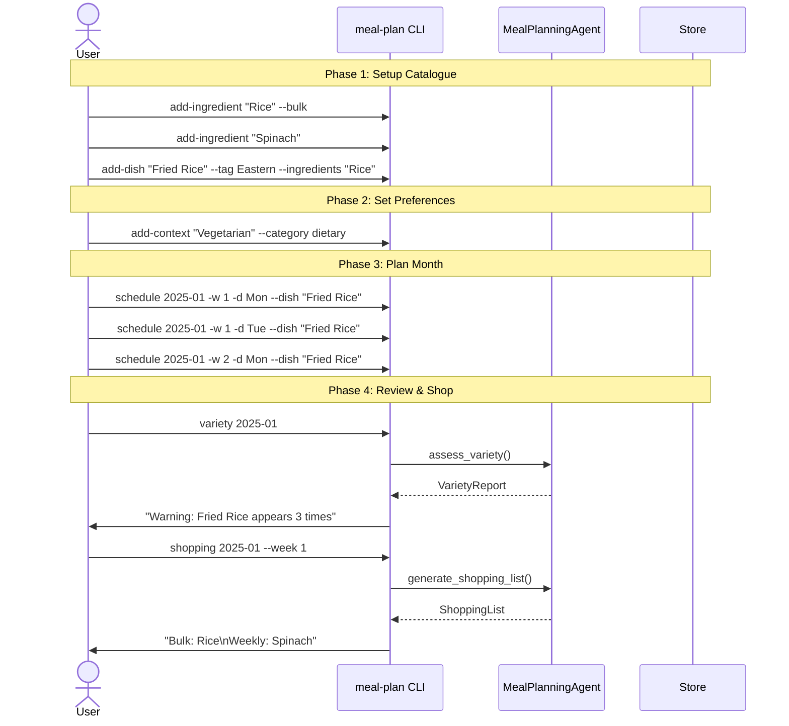
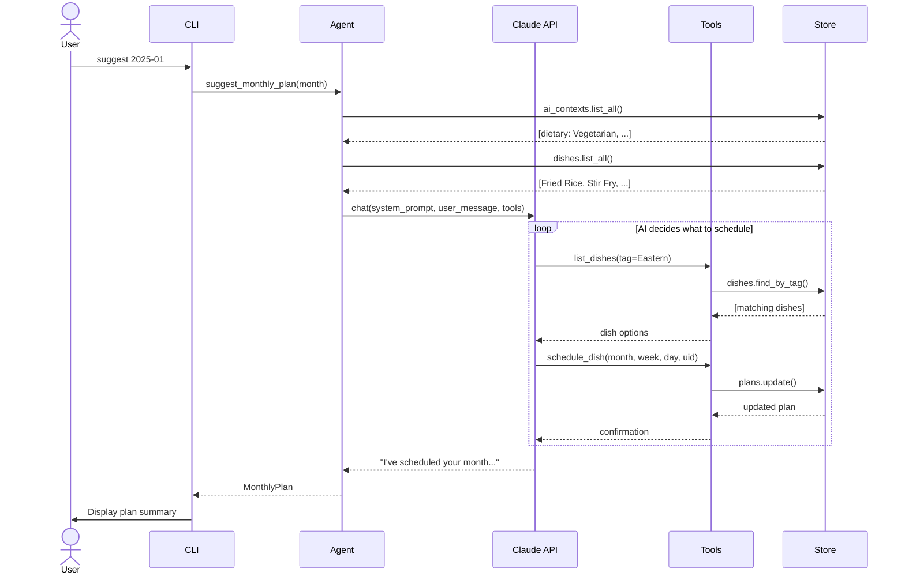

# Meal Planning System

> A KISS (Keep It Simple, Stupid) meal planning application following Domain-Driven Design principles, Cosmic Python patterns, and functional programming practices.

## Table of Contents

- [Introduction: Why This Architecture?](#introduction-why-this-architecture)
- [Quick Start](#quick-start)
- [Technologies](#technologies)
- [Architecture Overview](#architecture-overview)
- [Bounded Contexts](#bounded-contexts)
- [Key Patterns Explained](#key-patterns-explained)
- [Data Flow Diagrams](#data-flow-diagrams)
- [Use Case Sequences](#use-case-sequences)
- [CLI Reference](#cli-reference)
- [Extending the System](#extending-the-system)

---

## Introduction: Why This Architecture?

Hey there! Let me walk you through why we built this system the way we did. I've been building systems at scale for a while, and the biggest lesson I've learned is this: **the best architecture is the one you can understand, modify, and extend without fear**.

### The Problem We're Solving

You want to plan meals for a month, generate shopping lists, and maybe have an AI help suggest dishes. Simple enough, right? But here's the thing—simple requirements have a way of growing. Today it's meal planning; tomorrow it's nutritional tracking, recipe scaling, or integration with grocery delivery services.

So we need an architecture that:
1. **Starts simple** - No over-engineering. A JSON file is fine.
2. **Stays flexible** - When you need MongoDB, you can swap it in.
3. **Remains understandable** - Any engineer should grok it in an hour.

### The Solution: Bounded Contexts + Repository Pattern + Functional Core

We borrowed three big ideas:

1. **From Domain-Driven Design**: Bounded Contexts separate concerns (catalogue vs. planning vs. AI)
2. **From Cosmic Python**: Repository pattern keeps domain pure, swappable persistence
3. **From Functional Programming**: Immutable models, pure functions, explicit error handling

The result? A system where:
- Your domain logic (ingredients, dishes, plans) knows nothing about JSON or databases
- Your AI agent is just an "adapter" that calls tools—easy to test, easy to mock
- Everything is immutable, so no spooky action at a distance

---

## Quick Start

```bash
# Install dependencies
uv sync

# Seed with sample data
uv run meal-plan seed

# List dishes in catalogue
uv run meal-plan list-dishes

# Schedule a dish
uv run meal-plan schedule 2025-01 --week 1 --day Mon --dish "Kimchee Fried Rice"

# View the plan
uv run meal-plan show 2025-01

# Generate shopping list
uv run meal-plan shopping 2025-01 --week 1
```

---

## Technologies

Let me walk you through the technology choices. Each library was selected deliberately—not because it's trendy, but because it solves a specific problem better than the alternatives. Understanding *why* we use each tool is as important as knowing *how*.

### Technology Stack Overview

```
┌─────────────────────────────────────────────────────────────────────────────┐
│                            DEPENDENCY GRAPH                                  │
├─────────────────────────────────────────────────────────────────────────────┤
│                                                                             │
│                              ┌─────────┐                                    │
│                              │   CLI   │                                    │
│                              └────┬────┘                                    │
│                                   │                                         │
│                    ┌──────────────┼──────────────┐                         │
│                    │              │              │                         │
│                    ▼              ▼              ▼                         │
│              ┌─────────┐   ┌─────────┐   ┌─────────────┐                   │
│              │  Typer  │   │  Rich   │   │  Pydantic   │                   │
│              │  (CLI   │   │ (Output │   │  (Domain    │                   │
│              │  Parser)│   │ Render) │   │   Models)   │                   │
│              └─────────┘   └─────────┘   └──────┬──────┘                   │
│                                                 │                          │
│                                                 ▼                          │
│                                          ┌─────────────┐                   │
│                                          │   Polars    │                   │
│                                          │  (Future:   │                   │
│                                          │  Analytics) │                   │
│                                          └─────────────┘                   │
│                                                                             │
└─────────────────────────────────────────────────────────────────────────────┘
```

| Package | Version | Layer | Purpose |
|---------|---------|-------|---------|
| **Pydantic** | >=2.12.5 | Domain | Data validation, serialization, immutable models |
| **Typer** | >=0.9.0 | CLI | Command-line interface framework |
| **Rich** | >=13.0.0 | CLI | Terminal formatting, tables, colors |
| **Polars** | >=1.36.1 | Services | Data analysis (future: nutrition analytics) |

---

### Pydantic: The Domain Layer Foundation

**Where it fits**: Every model in `domain/models.py` across all bounded contexts.

**What it does**: Pydantic gives us runtime type validation, automatic serialization, and—crucially—immutability via `frozen=True`.

#### With Pydantic (What We Have)

```python
# catalogue/domain/models.py
from pydantic import BaseModel, Field

class VOIngredient(BaseModel, frozen=True):
    """Immutable, validated, serializable."""
    uid: str = Field(default_factory=_ingredient_uid)
    name: str
    tags: tuple[IngredientTag, ...] = ()
    purchase_type: PurchaseType = PurchaseType.WEEKLY

# Usage
rice = VOIngredient(name="Rice", purchase_type=PurchaseType.BULK)

# Validation happens automatically
bad = VOIngredient(name=123)  # ValidationError: name must be str

# Immutability enforced
rice.name = "Pasta"  # FrozenInstanceError!

# Serialization is free
rice.model_dump()  # {'uid': 'ING-abc123', 'name': 'Rice', ...}
rice.model_dump_json()  # '{"uid": "ING-abc123", "name": "Rice", ...}'

# Deserialization with validation
VOIngredient.model_validate({"name": "Rice", "purchase_type": "bulk"})
```

#### Without Pydantic (The Alternative)

```python
# Using plain dataclasses
from dataclasses import dataclass, field, asdict
import json

@dataclass(frozen=True)
class VOIngredient:
    uid: str = field(default_factory=_ingredient_uid)
    name: str = ""  # Can't enforce required without __post_init__
    tags: tuple = ()
    purchase_type: str = "weekly"

    def __post_init__(self):
        # Manual validation - you write ALL of this
        if not isinstance(self.name, str):
            raise TypeError("name must be str")
        if not self.name:
            raise ValueError("name is required")
        if self.purchase_type not in ("bulk", "weekly"):
            raise ValueError(f"Invalid purchase_type: {self.purchase_type}")
        # Enum conversion? Do it yourself
        # Nested model validation? More code
        # ...50 more lines for a real model

    def to_dict(self):
        # asdict() doesn't handle enums, custom types
        return {
            "uid": self.uid,
            "name": self.name,
            "tags": [t.value for t in self.tags],  # Manual enum handling
            "purchase_type": self.purchase_type,
        }

    @classmethod
    def from_dict(cls, data):
        # Manual deserialization
        return cls(
            uid=data.get("uid", _ingredient_uid()),
            name=data["name"],
            tags=tuple(IngredientTag(t) for t in data.get("tags", [])),
            purchase_type=data.get("purchase_type", "weekly"),
        )
```

#### The Value Add

| Concern | Pydantic | Dataclass |
|---------|----------|-----------|
| Validation | Automatic, declarative | Manual `__post_init__` |
| Serialization | `model_dump()`, `model_dump_json()` | Manual `to_dict()` |
| Deserialization | `model_validate()` with coercion | Manual `from_dict()` |
| Nested models | Automatic | Recursive manual code |
| Enum handling | Automatic value/name conversion | Manual |
| Error messages | Detailed, structured | Whatever you write |
| IDE support | Full type hints preserved | Same |
| Lines of code | ~10 | ~50+ per model |

**Bottom line**: Pydantic eliminates 80% of boilerplate while adding safety. Every domain model gets validation for free. When we save to JSON, `model_dump()` handles everything. When we load from JSON, `model_validate()` catches bad data before it enters our domain.

---

### Typer: The CLI Framework

**Where it fits**: `cli/main.py` - the entry point for all user commands.

**What it does**: Typer turns Python functions into CLI commands with automatic argument parsing, help text, and type conversion.

#### With Typer (What We Have)

```python
# cli/main.py
import typer
from typing import Optional

app = typer.Typer(name="meal-plan", help="AI-powered meal planning CLI")

@app.command()
def schedule(
    month: str = typer.Argument(..., help="Month in format YYYY-MM"),
    week: int = typer.Option(..., "--week", "-w", help="Week number (1-4)"),
    day: str = typer.Option(..., "--day", "-d", help="Day (Mon, Tue, etc.)"),
    dish: Optional[str] = typer.Option(None, "--dish", help="Dish name"),
):
    """Schedule a dish for a specific day."""
    # Your logic here - arguments already parsed and validated
    print(f"Scheduling {dish} for {day} Week {week} in {month}")

if __name__ == "__main__":
    app()
```

Running it:
```bash
$ meal-plan schedule --help
Usage: meal-plan schedule [OPTIONS] MONTH

  Schedule a dish for a specific day.

Arguments:
  MONTH  Month in format YYYY-MM  [required]

Options:
  -w, --week INTEGER  Week number (1-4)  [required]
  -d, --day TEXT      Day (Mon, Tue, etc.)  [required]
  --dish TEXT         Dish name
  --help              Show this message and exit.

$ meal-plan schedule 2025-01 -w 1 -d Mon --dish "Fried Rice"
Scheduling Fried Rice for Mon Week 1 in 2025-01
```

#### Without Typer (The Alternative)

```python
# Using argparse (standard library)
import argparse
from typing import Optional

def create_parser():
    parser = argparse.ArgumentParser(
        prog="meal-plan",
        description="AI-powered meal planning CLI"
    )
    subparsers = parser.add_subparsers(dest="command", help="Commands")

    # Schedule command
    schedule_parser = subparsers.add_parser("schedule", help="Schedule a dish")
    schedule_parser.add_argument("month", help="Month in format YYYY-MM")
    schedule_parser.add_argument("-w", "--week", type=int, required=True,
                                  help="Week number (1-4)")
    schedule_parser.add_argument("-d", "--day", required=True,
                                  help="Day (Mon, Tue, etc.)")
    schedule_parser.add_argument("--dish", default=None,
                                  help="Dish name")

    # Add more commands... each needs its own parser setup
    # list_parser = subparsers.add_parser("list-dishes", ...)
    # show_parser = subparsers.add_parser("show", ...)
    # ... repeat for every command

    return parser

def schedule(args):
    """Schedule command handler."""
    print(f"Scheduling {args.dish} for {args.day} Week {args.week}")

def main():
    parser = create_parser()
    args = parser.parse_args()

    if args.command == "schedule":
        schedule(args)
    elif args.command == "list-dishes":
        list_dishes(args)
    # ... dispatch for every command

if __name__ == "__main__":
    main()
```

#### The Value Add

| Concern | Typer | Argparse |
|---------|-------|----------|
| Command definition | Decorator on function | Separate parser setup |
| Type conversion | Automatic from hints | Manual `type=int` |
| Required args | `...` or `Optional` | `required=True` |
| Help text | From docstring + hints | Manual strings |
| Subcommands | Automatic from functions | Manual subparser setup |
| Dispatch | Automatic | Manual if/elif chain |
| Lines per command | ~5 | ~15-20 |

**Bottom line**: Typer turns your function signature into a CLI. Docstrings become help text. Type hints become validators. Adding a new command is just adding a decorated function.

---

### Rich: Beautiful Terminal Output

**Where it fits**: `cli/main.py` - all user-facing output.

**What it does**: Rich renders tables, colors, progress bars, and formatted text in the terminal.

#### With Rich (What We Have)

```python
# cli/main.py
from rich.console import Console
from rich.table import Table

console = Console()

@app.command()
def list_ingredients():
    """List all ingredients in the catalogue."""
    ingredients = ctx.store.ingredients.list_all()

    table = Table(title="Ingredients")
    table.add_column("UID", style="dim")
    table.add_column("Name")
    table.add_column("Tags")
    table.add_column("Purchase", style="green")

    for ing in ingredients:
        table.add_row(
            ing.uid,
            ing.name,
            ", ".join(t.value for t in ing.tags),
            ing.purchase_type.value,
        )

    console.print(table)
```

Output:
```
                    Ingredients
┏━━━━━━━━━━━━━┳━━━━━━━━━┳━━━━━━━━━━━┳━━━━━━━━━━┓
┃ UID         ┃ Name    ┃ Tags      ┃ Purchase ┃
┡━━━━━━━━━━━━━╇━━━━━━━━━╇━━━━━━━━━━━╇━━━━━━━━━━┩
│ ING-abc123  │ Rice    │ Grain     │ bulk     │
│ ING-def456  │ Spinach │ Vegetable │ weekly   │
│ ING-ghi789  │ Eggs    │ Protein   │ weekly   │
└─────────────┴─────────┴───────────┴──────────┘
```

Error handling with colors:
```python
console.print("[red]Error: Dish not found[/red]")
console.print("[green]Added ingredient: Rice[/green]")
console.print("[yellow]Warning: Ingredient 'Tofu' not found[/yellow]")
```

#### Without Rich (The Alternative)

```python
# Using plain print
def list_ingredients():
    ingredients = ctx.store.ingredients.list_all()

    # Manual table formatting
    header = f"{'UID':<15} {'Name':<15} {'Tags':<15} {'Purchase':<10}"
    separator = "-" * len(header)

    print("\nIngredients")
    print(separator)
    print(header)
    print(separator)

    for ing in ingredients:
        tags = ", ".join(t.value for t in ing.tags)
        print(f"{ing.uid:<15} {ing.name:<15} {tags:<15} {ing.purchase_type.value:<10}")

    print(separator)

# No colors without ANSI codes
def print_error(msg):
    # ANSI escape codes - not portable, ugly
    print(f"\033[91mError: {msg}\033[0m")

def print_success(msg):
    print(f"\033[92m{msg}\033[0m")
```

Output:
```
Ingredients
------------------------------------------------------------
UID             Name            Tags            Purchase
------------------------------------------------------------
ING-abc123      Rice            Grain           bulk
ING-def456      Spinach         Vegetable       weekly
------------------------------------------------------------
```

#### The Value Add

| Concern | Rich | Plain print |
|---------|------|-------------|
| Tables | `Table()` with borders, alignment | Manual string formatting |
| Colors | `[red]text[/red]` markup | Raw ANSI escape codes |
| Cross-platform | Works everywhere | ANSI codes fail on Windows |
| Progress bars | `Progress()` | Manual `\r` hacking |
| Markdown | `Markdown()` renders in terminal | Plain text only |
| Tracebacks | Beautiful, syntax-highlighted | Default Python |
| Lines of code | ~10 for table | ~20+ for basic table |

**Bottom line**: Rich makes your CLI look professional with minimal code. Users see beautiful tables and colored output. You write `console.print(table)` instead of formatting strings.

---

### Polars: Future-Ready Analytics

**Where it fits**: `planning/services/analysis.py` - data analysis and reporting.

**What it does**: Polars is a blazing-fast DataFrame library. We've included it for future nutritional analysis, meal statistics, and bulk data operations.

#### Why Polars Over Pandas?

```python
# Current: Simple analysis without DataFrames
def assess_variety(plan, dish_repo) -> VarietyReport:
    all_dishes = [uid for week in plan.weeks for uid in week.all_dish_uids() if uid]
    dish_counts = Counter(all_dishes)
    # ... simple Python

# Future: Complex nutritional analysis with Polars
import polars as pl

def analyze_monthly_nutrition(plan, dish_repo, ingredient_repo):
    # Build DataFrame from plan data
    meals_df = pl.DataFrame({
        "week": [...],
        "day": [...],
        "dish_uid": [...],
    })

    # Join with nutritional data
    nutrition_df = meals_df.join(
        get_nutrition_data(),
        on="dish_uid"
    )

    # Complex aggregations - Polars is 10-100x faster than Pandas
    weekly_summary = nutrition_df.group_by("week").agg([
        pl.col("calories").sum(),
        pl.col("protein").mean(),
        pl.col("carbs").sum(),
    ])

    return weekly_summary
```

#### Polars vs Pandas

```python
# Pandas (what most people use)
import pandas as pd

df = pd.DataFrame(data)
result = df.groupby("week")["calories"].sum()
# Mutable by default, GIL-bound, slower on large data

# Polars (what we chose)
import polars as pl

df = pl.DataFrame(data)
result = df.group_by("week").agg(pl.col("calories").sum())
# Immutable expressions, Rust-powered, parallel execution
```

| Concern | Polars | Pandas |
|---------|--------|--------|
| Speed | 10-100x faster | Baseline |
| Memory | More efficient | Higher usage |
| Parallelism | Automatic multi-core | GIL-limited |
| API style | Expression-based (functional) | Method chaining (OOP) |
| Immutability | Default | Opt-in |
| Null handling | Explicit | NaN confusion |

**Why we chose Polars**: It aligns with our functional programming philosophy. Polars operations are immutable expressions, just like our domain models. When we add nutritional tracking, Polars will handle the data crunching without slowing down the app.

**Current usage**: Minimal. Polars is ready for when we need it.

**Future usage**:
- Monthly nutrition reports
- Shopping list optimization
- Meal pattern analysis
- Budget tracking

---

### How Technologies Map to Architecture

```
┌─────────────────────────────────────────────────────────────────────────────┐
│                                  CLI                                        │
│  ┌─────────────────────────────────────────────────────────────────────┐   │
│  │  Typer: Parse "meal-plan schedule 2025-01 -w 1 -d Mon --dish X"     │   │
│  │  Rich: Display tables, colors, formatted output                      │   │
│  └─────────────────────────────────────────────────────────────────────┘   │
└─────────────────────────────────────┬───────────────────────────────────────┘
                                      │
                                      ▼
┌─────────────────────────────────────────────────────────────────────────────┐
│                            APPLICATION                                       │
│  ┌─────────────────────────────────────────────────────────────────────┐   │
│  │  Pydantic: Validate data entering/leaving the system                 │   │
│  └─────────────────────────────────────────────────────────────────────┘   │
└─────────────────────────────────────┬───────────────────────────────────────┘
                                      │
         ┌────────────────────────────┼────────────────────────────┐
         │                            │                            │
         ▼                            ▼                            ▼
┌─────────────────┐        ┌─────────────────┐        ┌─────────────────┐
│   CATALOGUE     │        │    PLANNING     │        │       AI        │
│   ───────────   │        │   ───────────   │        │   ───────────   │
│                 │        │                 │        │                 │
│   Pydantic:     │        │   Pydantic:     │        │   Pydantic:     │
│   VOIngredient  │        │   MonthlyPlan   │        │   VOAIContext   │
│   VODish        │        │   WeekPlan      │        │                 │
│                 │        │                 │        │                 │
│                 │        │   Polars:       │        │                 │
│                 │        │   (future)      │        │                 │
│                 │        │   analytics     │        │                 │
└─────────────────┘        └─────────────────┘        └─────────────────┘
         │                            │                            │
         └────────────────────────────┼────────────────────────────┘
                                      │
                                      ▼
┌─────────────────────────────────────────────────────────────────────────────┐
│                            PERSISTENCE                                       │
│  ┌─────────────────────────────────────────────────────────────────────┐   │
│  │  Pydantic: model_dump() → JSON, model_validate() ← JSON              │   │
│  │  (Standard library json module for file I/O)                         │   │
│  └─────────────────────────────────────────────────────────────────────┘   │
└─────────────────────────────────────────────────────────────────────────────┘
```

---

### Summary: Why These Choices?

| Library | Problem Solved | Alternative Pain |
|---------|----------------|------------------|
| **Pydantic** | "I need validated, immutable domain models with zero boilerplate" | 50+ lines per model for manual validation/serialization |
| **Typer** | "I need a CLI that grows with my app" | Argparse boilerplate, manual dispatch |
| **Rich** | "Users deserve beautiful output" | String formatting, ANSI codes, Windows issues |
| **Polars** | "Future analytics without rewriting" | Pandas migration later, performance issues |

The key insight: **each library does one thing exceptionally well**. Pydantic owns the domain layer. Typer owns CLI parsing. Rich owns output rendering. Polars will own data analysis. No overlap, no confusion.

---

## Architecture Overview

Let me draw you a picture. Here's how all the pieces fit together:

```
┌─────────────────────────────────────────────────────────────────────────────┐
│                              CLI LAYER                                       │
│  meal-plan add-dish, schedule, shopping, variety                            │
└────────────────────────────────────┬────────────────────────────────────────┘
                                     │
                                     ▼
┌─────────────────────────────────────────────────────────────────────────────┐
│                           APPLICATION LAYER                                  │
│  AppContext, Store, MealPlanningAgent                                       │
│  (Wires everything together, provides unified access)                       │
└────────────────────────────────────┬────────────────────────────────────────┘
                                     │
           ┌─────────────────────────┼─────────────────────────┐
           │                         │                         │
           ▼                         ▼                         ▼
┌──────────────────┐    ┌──────────────────┐    ┌──────────────────┐
│    CATALOGUE     │    │     PLANNING     │    │        AI        │
│  Bounded Context │    │  Bounded Context │    │  Bounded Context │
├──────────────────┤    ├──────────────────┤    ├──────────────────┤
│ domain/          │    │ domain/          │    │ domain/          │
│  - models.py     │    │  - models.py     │    │  - context.py    │
│  - enums.py      │    │  - enums.py      │    │                  │
│                  │    │                  │    │ tools/           │
│ repositories/    │    │ repositories/    │    │  - catalogue_    │
│  - protocols.py  │    │  - protocols.py  │    │  - planning_     │
│  - json_repos.py │    │  - json_repos.py │    │  - analysis_     │
│                  │    │                  │    │                  │
│                  │    │ services/        │    │ agent.py         │
│                  │    │  - shopping.py   │    │ prompts.py       │
│                  │    │  - analysis.py   │    │                  │
└──────────────────┘    └──────────────────┘    └──────────────────┘
           │                         │                         │
           └─────────────────────────┼─────────────────────────┘
                                     │
                                     ▼
┌─────────────────────────────────────────────────────────────────────────────┐
│                            SHARED LAYER                                      │
│  types.py (Result, Ok, Err), persistence/json_store.py                      │
└─────────────────────────────────────────────────────────────────────────────┘
                                     │
                                     ▼
                            ┌─────────────────┐
                            │  data/meals.json │
                            │  (Just a file!)  │
                            └─────────────────┘
```

### Why This Layering?

Think of it like a good restaurant:
- **CLI** is the waiter—takes orders, presents food, handles customer interaction
- **App Layer** is the head chef—coordinates everything, knows who does what
- **Bounded Contexts** are the stations—each focused on one thing (salads, mains, desserts)
- **Shared** is the pantry—common ingredients everyone uses
- **JSON file** is the walk-in fridge—where stuff is stored

The key insight: **each layer only talks to the layer below it**. The CLI never touches JSON directly. The domain never knows about persistence. This is what makes the system flexible.

---

## Bounded Contexts

Let me explain each bounded context in detail. Think of these as "mini applications" that happen to work together.

### Catalogue Context

**Purpose**: Manage the ingredient and dish master data.

**This is your "reference data"**—stuff that changes rarely. You add ingredients once, use them forever.

```
catalogue/
├── domain/
│   ├── enums.py      # PurchaseType (bulk/weekly), IngredientTag, DishTag
│   └── models.py     # VOIngredient, VODish
└── repositories/
    ├── protocols.py  # IngredientRepository, DishRepository (interfaces)
    └── json_repos.py # JsonIngredientRepository (implementation)
```

**Key Model: VOIngredient**
```python
class VOIngredient(BaseModel, frozen=True):
    uid: str              # "ING-abc123"
    name: str             # "Rice"
    tags: tuple[...]      # (IngredientTag.GRAIN,)
    purchase_type: ...    # PurchaseType.BULK
```

Notice `frozen=True`? That makes it **immutable**. You can't do `ingredient.name = "Pasta"`. Instead:
```python
new_ingredient = ingredient.model_copy(update={"name": "Pasta"})
```

This is functional programming in action. The original is unchanged. No surprises.

### Planning Context

**Purpose**: Manage meal plans and scheduling.

**This is your "transactional data"**—it changes often. Every time you plan a meal, this context is involved.

```
planning/
├── domain/
│   ├── enums.py      # Day enum (Mon, Tue, ...)
│   └── models.py     # WeekPlan (Value Object), MonthlyPlan (Aggregate Root)
├── repositories/
│   └── json_repos.py # JsonPlanRepository
└── services/
    ├── shopping.py   # generate_shopping_list() pure function
    └── analysis.py   # assess_variety() pure function
```

**The Aggregate Root Pattern**

`MonthlyPlan` is our aggregate root. It "owns" the `WeekPlan` value objects inside it.

```python
class MonthlyPlan(BaseModel, frozen=True):
    uid: str     # "PLAN-2025-01"
    month: str   # "2025-01"
    weeks: tuple[WeekPlan, WeekPlan, WeekPlan, WeekPlan]  # Exactly 4 weeks
```

Why tuple, not list? **Immutability**. You can't accidentally `plan.weeks.append(...)`.

**Pure Functions for Business Logic**

Look at `shopping.py`. It's a **pure function**:
```python
def generate_shopping_list(
    plan: MonthlyPlan,
    week_num: int,
    dish_repo: DishRepository,
    ingredient_repo: IngredientRepository,
) -> ShoppingList:
    # No side effects. Same input = same output. Easy to test!
```

This function doesn't modify anything. It takes data, computes a result, returns it. That's functional programming.

### AI Context

**Purpose**: Orchestrate AI-driven meal planning.

**This is your "adapter layer"**—the AI is not part of your domain. It's an external system that happens to call your domain logic.

```
ai/
├── domain/
│   └── context.py    # VOAIContext (user preferences)
├── repositories/
│   └── json_repos.py # Store contexts
├── tools/            # Functions the AI can call
│   ├── catalogue_tools.py
│   ├── planning_tools.py
│   └── analysis_tools.py
├── agent.py          # MealPlanningAgent
└── prompts.py        # System prompts for AI
```

**The Agent is an Adapter**

Here's a crucial insight: the `MealPlanningAgent` is **not domain logic**. It's an adapter, just like the CLI. It takes user intent and translates it into domain operations.

```python
class MealPlanningAgent:
    def schedule_dish(self, month, week_num, day, dish_uid):
        plan = self.get_plan(month)
        updated_plan = plan.schedule_dish(week_num, day, dish_uid)
        self.store.plans.update(updated_plan)
        return updated_plan
```

The agent calls the domain (`plan.schedule_dish`), not the other way around.

---

## Key Patterns Explained

### 1. The Repository Pattern

**Problem**: You want to swap JSON for MongoDB without rewriting your domain.

**Solution**: Abstract the storage behind an interface.

```python
# Protocol (interface) - in protocols.py
class IngredientRepository(Protocol):
    def add(self, ingredient: VOIngredient) -> Result[...]: ...
    def get(self, uid: str) -> Result[...]: ...
    def list_all(self) -> Sequence[VOIngredient]: ...

# Implementation - in json_repos.py
class JsonIngredientRepository:
    def __init__(self, store: JsonStore):
        self._store = store

    def add(self, ingredient):
        self._store.ingredient_bank[ingredient.uid] = ingredient.model_dump()
        return Ok(ingredient)
```

Tomorrow, you write `MongoIngredientRepository`. Swap it in `bootstrap.py`. Domain code unchanged.

### 2. Result Types (Functional Error Handling)

**Problem**: Exceptions are invisible. You don't know if a function can fail until it blows up.

**Solution**: Return `Result[T, E]` types that force you to handle errors.

```python
# Instead of:
def get(uid: str) -> VOIngredient:  # Might raise NotFoundError!
    ...

# We do:
def get(uid: str) -> Result[VOIngredient, NotFoundError]:
    if uid not in self._store:
        return Err(NotFoundError(entity="Ingredient", uid=uid))
    return Ok(VOIngredient.model_validate(self._store[uid]))
```

Now the caller **must** handle both cases:
```python
result = repo.get("ING-123")
if result.is_ok():
    ingredient = result.unwrap()
else:
    print(f"Not found: {result.error}")
```

Or with pattern matching (Python 3.10+):
```python
match repo.get("ING-123"):
    case Ok(ingredient):
        print(ingredient.name)
    case Err(error):
        print(f"Error: {error}")
```

### 3. Immutable Models

**Problem**: Mutable state leads to bugs. Someone modifies an object, and suddenly things break elsewhere.

**Solution**: `frozen=True` makes Pydantic models immutable.

```python
class VODish(BaseModel, frozen=True):
    uid: str
    name: str
    ingredient_uids: tuple[str, ...]  # tuple, not list!

# This fails:
dish.name = "New Name"  # FrozenInstanceError!

# This works:
new_dish = dish.model_copy(update={"name": "New Name"})
```

The `with_*` methods provide a nice API:
```python
dish = dish.with_ingredient("ING-123")  # Returns new dish, original unchanged
```

### 4. Context Manager for Transactions

**Problem**: You want to load data, make changes, and save—atomically.

**Solution**: Use Python's `with` statement.

```python
with create_app() as ctx:
    ctx.store.ingredients.add(rice)
    ctx.store.dishes.add(fried_rice)
    # Automatically saved when you exit the with block
```

If an exception occurs, changes aren't saved. Clean and predictable.

---

## Data Flow Diagrams

Let me show you how data flows through the system for common operations.

### Adding an Ingredient



### Generating a Shopping List



### Scheduling a Dish (Immutable Update)



---

## Use Case Sequences

### Use Case 1: Monthly Meal Planning Workflow



### Use Case 2: AI-Assisted Planning (Future)



---

## CLI Reference

### Catalogue Commands

| Command | Description | Example |
|---------|-------------|---------|
| `add-ingredient` | Add ingredient to catalogue | `meal-plan add-ingredient "Rice" --tag Grain --bulk` |
| `add-dish` | Add dish to catalogue | `meal-plan add-dish "Fried Rice" --tag Eastern -i "Rice,Eggs"` |
| `list-ingredients` | List all ingredients | `meal-plan list-ingredients` |
| `list-dishes` | List all dishes | `meal-plan list-dishes` |

### Planning Commands

| Command | Description | Example |
|---------|-------------|---------|
| `show` | Display month's plan | `meal-plan show 2025-01` |
| `schedule` | Schedule a dish | `meal-plan schedule 2025-01 -w 1 -d Mon --dish "Fried Rice"` |
| `shopping` | Generate shopping list | `meal-plan shopping 2025-01 --week 1` |
| `variety` | Analyze plan variety | `meal-plan variety 2025-01` |

### Context Commands

| Command | Description | Example |
|---------|-------------|---------|
| `add-context` | Add AI context | `meal-plan add-context "Vegetarian" --category dietary` |
| `list-contexts` | List all contexts | `meal-plan list-contexts` |

### Utility Commands

| Command | Description | Example |
|---------|-------------|---------|
| `seed` | Populate with sample data | `meal-plan seed` |

---

## Extending the System

### Adding a New Persistence Layer (e.g., MongoDB)

1. Create `meal_planning/catalogue/repositories/mongo_repos.py`:
```python
class MongoIngredientRepository:
    def __init__(self, collection: Collection):
        self._collection = collection

    def add(self, ingredient: VOIngredient) -> Result[...]:
        self._collection.insert_one(ingredient.model_dump())
        return Ok(ingredient)
```

2. Update `meal_planning/app/bootstrap.py`:
```python
# Instead of JsonIngredientRepository
from catalogue.repositories.mongo_repos import MongoIngredientRepository
```

3. Domain code? **Unchanged**. That's the beauty of the Repository pattern.

### Adding a New Analysis Service

1. Add to `meal_planning/planning/services/`:
```python
# nutrition.py
def assess_nutrition(plan: MonthlyPlan, dish_repo, ingredient_repo) -> NutritionReport:
    # Pure function - compute nutritional analysis
    ...
```

2. Wire it up in the Agent:
```python
def get_nutrition_report(self, month: str) -> NutritionReport:
    return assess_nutrition(self.get_plan(month), self.store.dishes, ...)
```

3. Add CLI command:
```python
@app.command()
def nutrition(month: str):
    report = ctx.agent.get_nutrition_report(month)
    console.print(format_report(report))
```

### Adding AI-Powered Suggestions

1. Implement `AIClient` protocol with Claude:
```python
import anthropic

class ClaudeClient:
    def __init__(self, api_key: str):
        self.client = anthropic.Client(api_key)

    def chat(self, system_prompt, user_message, tools=None):
        response = self.client.messages.create(...)
        return response.content
```

2. Inject into Agent:
```python
agent = MealPlanningAgent(
    store=store,
    contexts=contexts,
    client=ClaudeClient(api_key),
)
```

---

## Final Thoughts

This architecture might seem like overkill for a meal planning app. But here's the thing: **it's not about the app, it's about the skills**.

By building this way, you've learned:
- How to separate concerns with bounded contexts
- How to keep domain logic pure and testable
- How to use functional patterns in Python
- How to design for change without over-engineering

These patterns scale. From a JSON file to a distributed system with message queues and event sourcing—the principles are the same.

Now go plan some meals.

---

*Built with love, following principles from Cosmic Python, Domain-Driven Design, and decades of hard-won engineering wisdom.*
