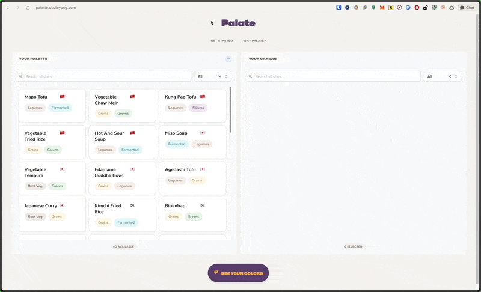

# Palate

**Count colors, cuisines, and kingdoms—not calories.**

[](https://www.python.org/downloads/)
[](LICENSE)
[](https://palatte.dudleyong.com)

---

## The Problem

Most "healthy eaters" are actually narrow eaters. Same breakfast. Same lunch rotation. Same four dinners. Beige. Repetitive. Boring for your gut, even if the foods themselves are fine.

Your gut doesn't want a diet. It wants range.

---

## The Solution

Palate is a meal planner that tracks dietary diversity—not calories, macros, or guilt. We show you what you're hitting and what you're missing. We help you fill the gaps.



---

## Quick Start

```bash
# Clone and run (30 seconds)
git clone https://github.com/lennardong/meal-planning.git
cd meal-planning
./devops/scripts/dev.sh

# Open http://localhost:8051
```

Or run with Docker:

```bash
docker build -f devops/docker/Dockerfile.dash-app -t palate .
docker run -p 8050:8060 palate
# Open http://localhost:8050
```

---

## What Palate Tracks

Three dimensions of variety:

| Dimension | What It Measures |
|-----------|------------------|
| **Colors** | 10 food categories—greens, legumes, grains, fermented, alliums, nuts/seeds, fruits, proteins, dairy, and red/orange veg |
| **Cuisines** | Cultural range across 11 cuisine types—Korean, Japanese, Indian, Mediterranean, and more |
| **Balance** | Eastern vs Western distribution across your week |

---

## Features

- **Kanban-style meal planning** — Drag dishes between catalogue and shortlist
- **Variety score with visual breakdown** — See exactly what you're hitting and missing
- **Blind spot detection** — "No fermented foods in 2 weeks"
- **Week-by-week meal plans** — Build out your month
- **Works offline, no account required** — Your data stays local

---

## Why Variety Matters

The research is clear: people who eat 30+ different plants a week have dramatically healthier microbiomes than people who eat 10 on repeat.

Diet apps tell you what to cut. Palate tells you what to add.

---

## Architecture

Built with Clean Architecture, Ports & Adapters, and functional programming practices.

| Doc | What It Covers |
|-----|----------------|
| **[App Architecture](meal_planning/docs/app-architecture.md)** | Domain models, services, BlobStore pattern, design decisions |
| **[Web Architecture](meal_planning/docs/web-architecture.md)** | Dash UI, callbacks, styling, state management |
| **[Session Architecture](meal_planning/docs/session-architecture.md)** | Multi-user support, session threading pattern |

---

## Tech Stack

| Layer | Tech |
|-------|------|
| Web UI | Dash + Mantine Components |
| Backend | Pure Python, Pydantic models |
| Storage | JSON files (swappable via BlobStore) |
| Deployment | Docker, Cloud Run |

---

## Development

```bash
# Install dependencies
uv sync

# Run development server (hot reload)
./devops/scripts/dev.sh

# Run tests
uv run pytest

# Seed with sample data
uv run meal seed
```

### CLI

```bash
uv run meal catalogue list dishes     # List all dishes
uv run meal plan show 2025-01         # View a month's plan
uv run meal shop list 2025-01 --week 1  # Generate shopping list
```

---

## Deployment

See [devops/README.md](devops/README.md) for Cloud Run deployment with GitHub Actions CI/CD.

---

## License

MIT

---

*Built because I'm a vegetarian who went for a gut health checkup and was shocked to learn my "healthy diet" was actually creating poor gut health. I was eating the same things over and over. This is the tool I wish I had.*
